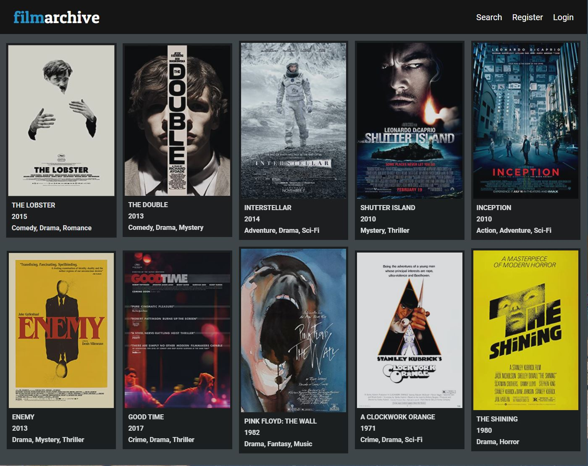
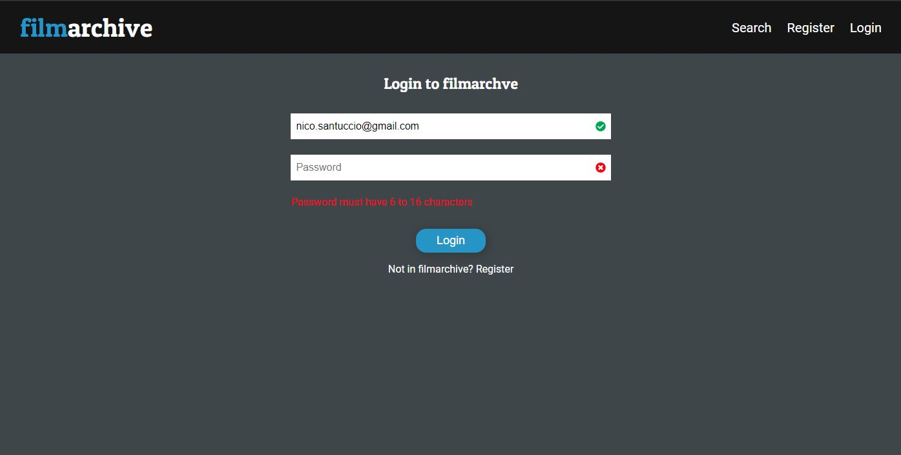
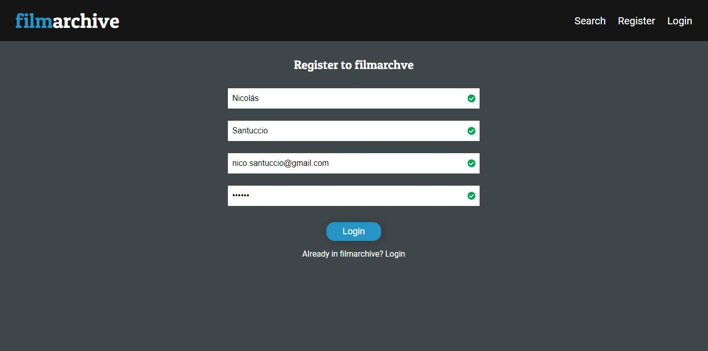
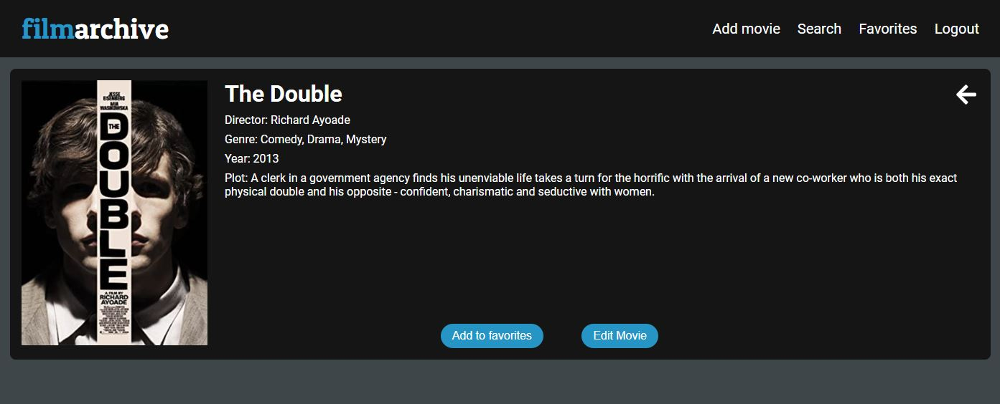
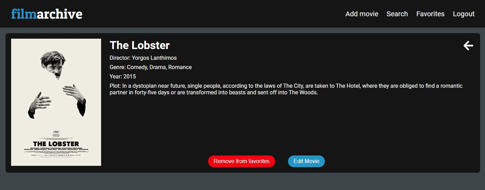
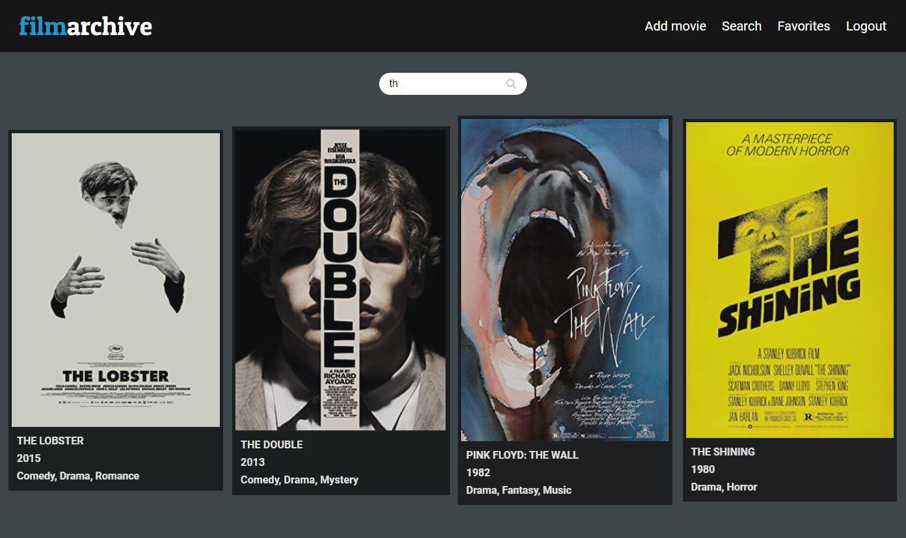
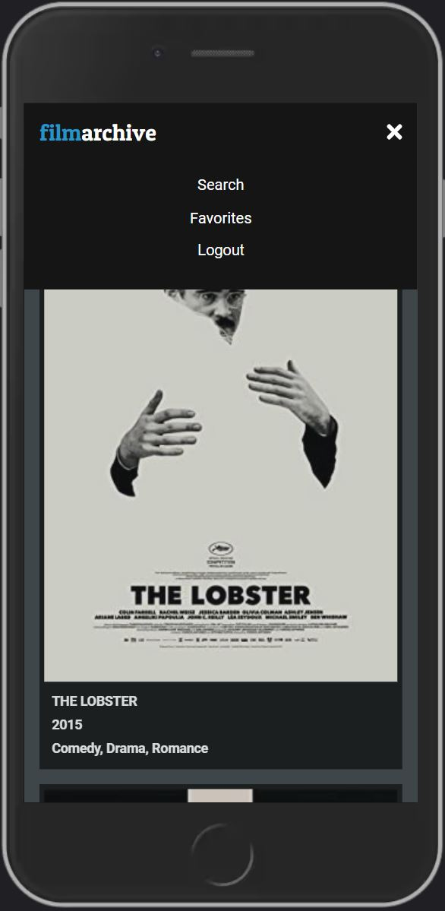
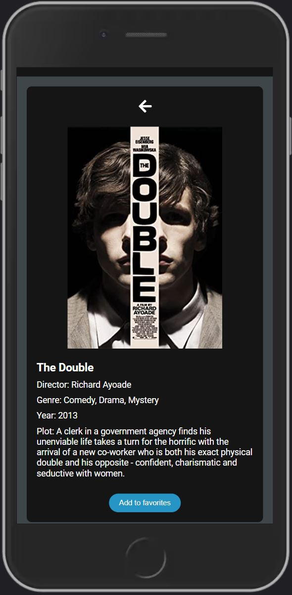
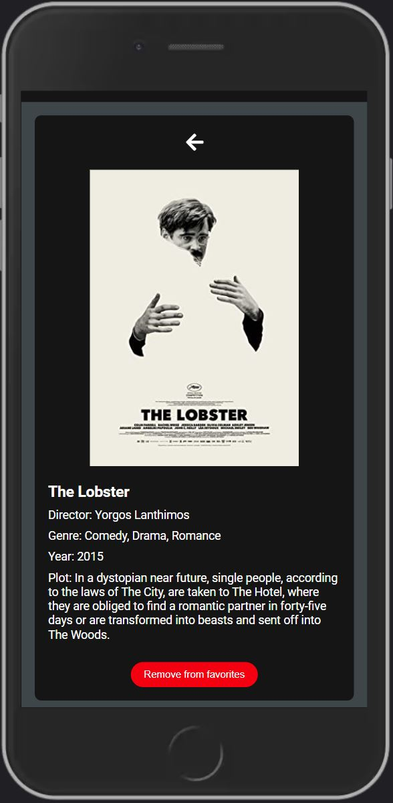
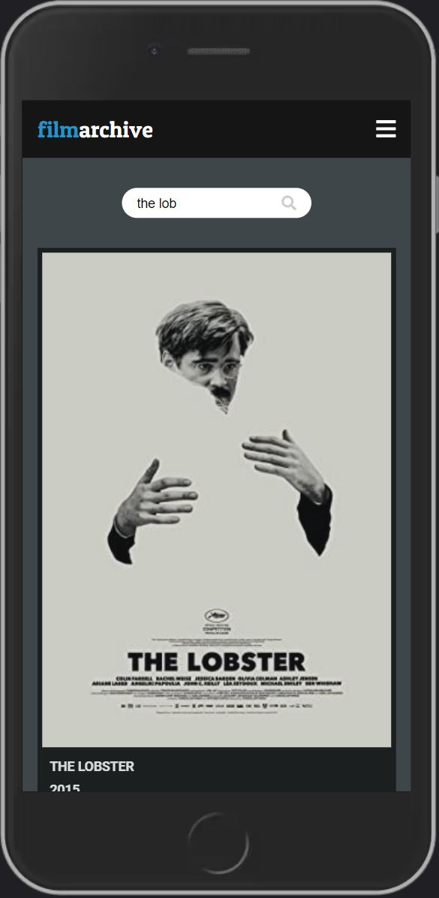

# filmarchive Front-End.
### 1. Rutas.

* /home
* /auth
* /register
* /search
* /movie-details/:id
* /favorites ***ruta privada***
* /add-movie ***ruta privada admin***
* /edit-movie/:id ***ruta privada admin***

  Las rutas de *login* y *registro* estan protegidas para que cuando un usario este activo no pueda acceder.

### 2. Imágenes desktop.








### 3. Imagenes mobile.






### 4. Variables de entorno.

```
REACT_APP_API_URL=http://localhost:4000
```
