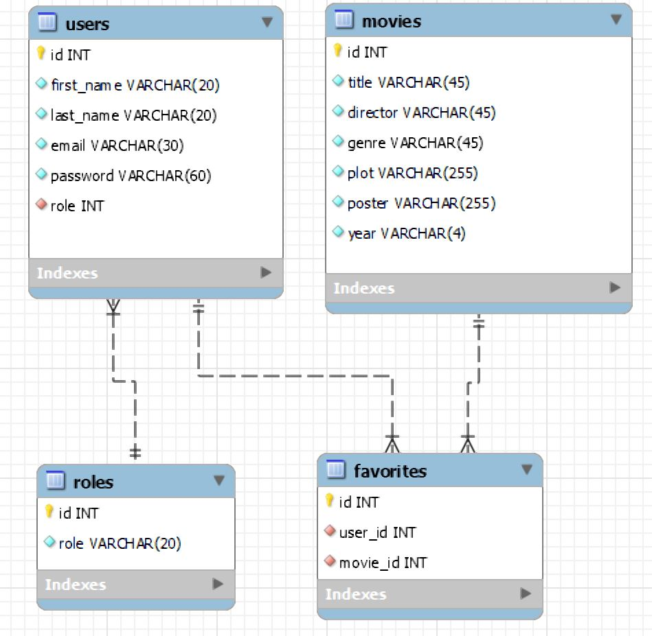

# filmarchive Back-End.

### 1. Endpoints.

**Auth.**
* /auth POST
* /register POST

**Movies.**

* /movies GET.
* /search GET. 
* /favorites GET.
* /movie GET.
* /add-favorites POST.
* /delete-favorite DELETE.
* /add-movie POST.
* /edit-movie/:id PUT.

### 2. Diseño de tablas.



*La tabla favorites tiene como índice la tupla(user_id movie_id) para evitar que el usuario tenga películas duplicadas.*

### 3. Variables de entorno.

```
PORT=4000
KEY=vt67z@LaXk7#AEIJyA0%jA$qjRk^U$xv
HOST=localhost
DATABASE=filmarchive
USER=root
PASSWORD=123456
```
